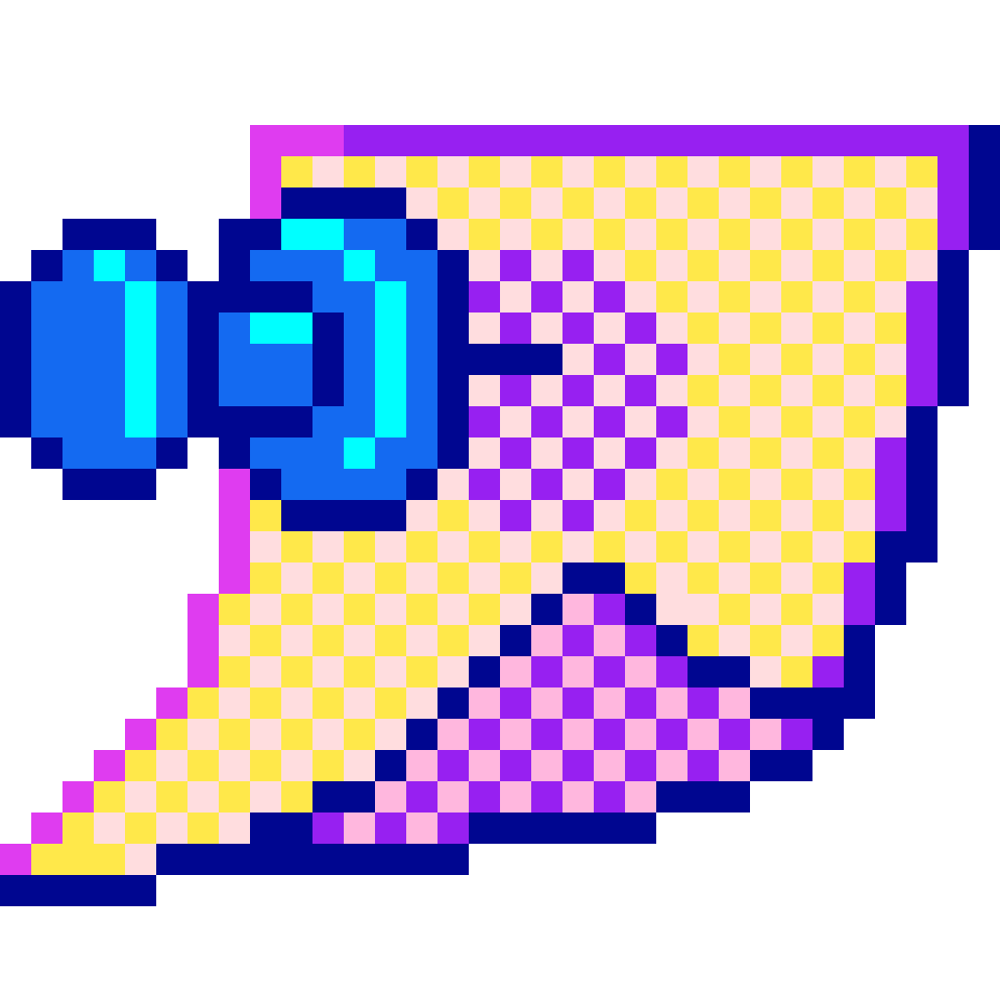
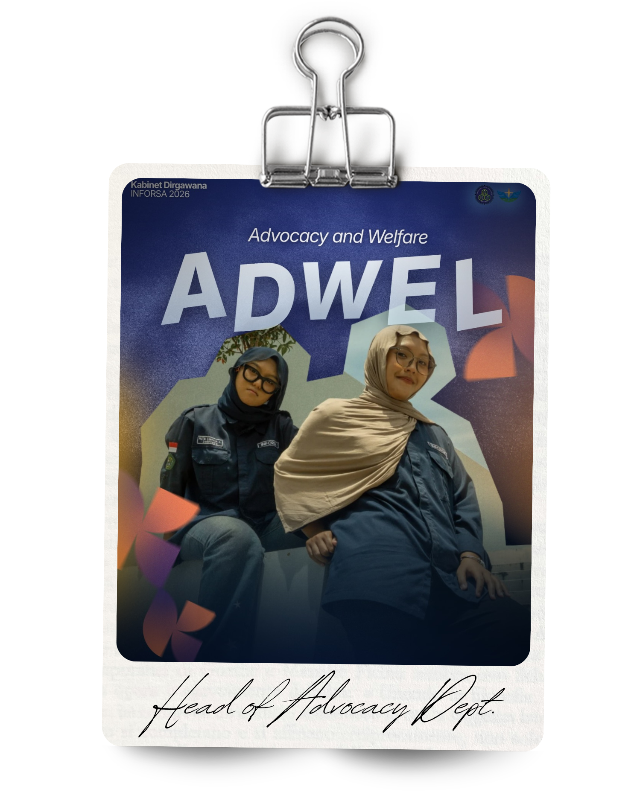

<h1 align="center">✮ Personal Portfolio: To the Passengers!</h1>
<p align="center">
  <i>A repository made for the Website-Based Programming for course in practicum; was made by Putri Syafana Afrillia (NIM: 2409116015). </i>
</p>

## **Introduction** ★

Mini Project ini merupakan dokumentasi hasil pembuatan website sederhana **Portofolio** berbasis **HTML dan CSS**, menggunakan _VUE JS dan Bootstrap_.

---

## **Table of Contents** 📋.ᐟ

* [**Introduction** ★](#introduction-)
* [**Portofolio Hands-On** ⸝⸝.ᐟ⋆.ᐟ](#portofolio-hands-on-)
    * [Features Checklist](#features-checklist-)
    * [Tools and Tech Stack](#tools-and-tech-stack-)
* [**Implemented Features** ᯓ★](#implemented-features-)
* [**Project Documentations** ⋆˚࿔.ᐟ](#project-documentations-)
    * [Library Structure](#library-structure--️)
    * [Program Flows & GUI](#program-flows--graphical-user-interface-gui-)
* [**Bonus Scores** ゛⸝⸝.ᐟ⋆](#bonus-scores-)
* [**Style Classes (CSS Explanation)** —͟͟͞͞★](#style-classes-in-the-css-)
* [**Part 2: Dynamic Data Integration** ᯓ★](#part-2-dynamic-data-integration-)
    * [New Files](#new-files-)
    * [Database Structure](#database-structure-)
    * [How It Works](#how-it-works-)

## **Portofolio Hands-On** ⸝⸝.ᐟ⋆.ᐟ
### Features Checklist ᯓ★

- [x] Section Home (Hero Section)
- [x] Section About Me / Skillset (Deskripsi & Pengalaman)
- [x] Section Certificates (Grid Layout)
- [x] Progress Bar untuk Skillset
- [x] Navigate Bar dan Gambar 
- [x] Integrasi Vue JS dan Bootstrap
- [x] Penggunaan struktur dasar HTML dan CSS untuk styling
- [x] Rapi, responsif dan statis.

### Tools and Tech Stack ᯓ★

Seluruh _dependency_ _framework_ di-_load_ secara eksternal melalui CDN (Content Delivery Network), sehingga proyek bersifat portable dan dapat dijalankan langsung tanpa proses instalasi atau build tools (NPM atau Webpack).

### Core Technologies ⍟

- [x] **HTML5** – Digunakan sebagai struktur semantik dasar halaman.
- [x] **CSS3** – Kustomisasi UI, implementasi Glassmorphism, dan layouting transisi.
- [x] **JavaScript** (ES6) – Digunakan untuk inisialisasi framework dan logika data.
- [x] **PHP** – Digunakan untuk koneksi dan pengambilan data dari database secara dinamis.
- [x] **MySQL** – Database untuk menyimpan data skills dan certificates.

### Frameworks & Libraries (CDN Powered) ⍟

- [x] **Bootstrap** 5.3.2 – Digunakan untuk Grid System, Responsive Layout, dan komponen UI.
- [x] **Vue JS** 3 (Global Build) – Digunakan untuk reactive data binding pada section Skillset dan Certificates melalui instance createApp.
- [x] **Google Fonts API** – Memuat font Jersey 20 dan Poppins untuk tipografi yang estetis.

### Development Tools ⍟
- [x] VS Code – Sebagai code editor utama dalam penulisan sintaks.
- [x] Live Server – Ekstensi VS Code untuk real-time preview saat proses coding.
- [x] Browser Developer Tools – Digunakan untuk debugging web.
- [x] Laragon – Local server environment untuk menjalankan PHP & MySQL.
- [x] phpMyAdmin – Manajemen database MySQL secara visual.

## Implemented Features ᯓ★
Berikut adalah rangkuman fitur yang sudah berhasil diimplementasikan sesuai dengan instruksi tugas:

- [x] Section Home (Hero Section) – Perkenalan utama dengan dekorasi visual.
- [x] Section About Me / Skillset – Deskripsi diri dan pengalaman organisasi.
- [x] Section Certificates (Grid Layout) – Penampilan sertifikat dalam bentuk card yang rapi.
- [x] Progress Bar untuk Skillset – Visualisasi level keahlian menggunakan komponen Bootstrap.
- [x] Navigate Bar dan Gambar – Navigasi yang fungsional dan penggunaan aset gambar yang optimal.

# **Project Documentations** ⋆˚࿔.ᐟ

## Library Structure ⊹ ࣪ ˖ ✔

Below is the structure of the **_library_ folder** which contains the main codes that are executed.

```

├── assets/              # Assets gambar, icon, dan background
│   ├── icons/           # Kumpulan icon
│   └── ...              # Foto sertifikat dan dekorasi
├── index.php            # File utama
├── koneksi.php          # Penghubung ke database
└── style.css            # Custom styling 

```

## Program Flows ⭑ & Graphical User Interface (GUI) —͟͟͞͞★

### Navigation Bar ⍟


Navigasi ini menggunakan komponen dari **Bootstrap 5** yang dimodifikasi menjadi _floating_ menggunakan CSS custom. Komponen ini tetap berada di atas halaman (_fixed-top_) untuk memudahkan navigasi pengguna.

``` html
<body>
    <div id="app">
        <nav class="navbar fixed-top custom-navbar">
            <div class="container">
                <div class="d-flex align-items-center">
                    
                    <a class="navbar-brand fw-bold text-white" style="text-shadow: 3px 3px 3px rgba(255, 255, 255, 0.08);" href="#">Portofolio</a>
                </div>
                <ul class="navbar-nav ms-auto">
                    <li class="nav-item">
                        <a class="nav-link fw-bold nav-pill" href="#home">Home</a>
                    </li>
                </ul>
            </div>
        </nav>
```

### Home & Hero ⍟


Bagian ini menampilkan halaman utama dengan menggunakan **Bootstrap Container** untuk menjaga konten tetap di tengah. Di sini banyak gambar dekoratif yang ditambahkan yang tujuannya agar website tidak terkesan membosankan. Banyak pula class yang diambil dari CSS yang mengatur supaya tombol teks dan gambar sesuai dengan format yang diinginkan juga konsisten.

``` html
        <section id="home" class="hero-section">
            
            <div class="container">
                <div class="row align-items-center">
                    <div class="col-lg-6">
                        <h1 class="hero-name">Putri S. Afrillia</h1>
                        <h2 class="hero-role">Designer & Developer ✮ </h2>
                        <p class="mt-3 hero-desc">Doing my breath out of Information System Major.</p>
                        <div class="mt-4">
                            <a href="#about" class="btn pill me-3 px-4">Get to know.</a>
                        </div>
                    </div>
                    <div class="col-lg-6 text-center position-relative mt-5 mt-lg-0">
                        
                    </div>
                </div>
            </div>
            
        </section>
```
Berikut adalah bagian perkenalan diri yang juga menjadi bagian dari _Hero Section_, terdiri dari nama, status, dan _button_ untuk lompat ke bagian _About Me_.


Di bawah ini adalah gambar pelengkap yang menunjukkan bahwa pengguna sedang menggulir ke bagian bawah (_skillset/about_).


### About Me .✦

Di sini berisi deskripsi pengalaman dan _skillset_ yang divisualisasikan dengan Bootstrap Progress Bar, kedua bagian dibungkus dengan masing-masing _card_ yang juga di-_styling_ lewat CSS.


``` dart
        <section id="about" class="py-5">
            <div class="container">
                <h2 class="hero-name text-center">Skillset ✮ </h2>
                <p class="text-center hero-role mb-5">It's not about these; it's about gaining and lock your self.</p>
                
                <div class="row">
                    <div class="col-md-6 mb-4">
                        <div class="card shadow-sm h-100">
                            <div class="card-body">
                                <h5 class="card-title fw-bold hero-role text-center mb-4">Skills ✪</h5>
                                <div v-for="skill in skills" :key="skill.name" class="mb-3">
                                    <p class="text-white mb-1">{{ skill.name }}</p>
                                    <div class="progress">
                                        <div class="progress-bar" :style="{ width: skill.level + '%' }">
                                            {{ skill.level }}%
                                        </div>
                                    </div>
                                </div>
                            </div>
                        </div>
                    </div>

                    <div class="col-md-6 mb-4">
                        <div class="card shadow-sm h-100">
                            <div class="card-body">
                                <h5 class="card-title fw-bold hero-role text-center mb-4">Experiences ✪</h5>
                                <div class="row align-items-center">
                                    <div class="col-5">
                                        
                                    </div>
                                    <div class="col-7">
                                        <p class="hero-desc">
                                            An IT student who has grown through more than 20 committees, five organizations, currently serve as Head of the Advocacy. I've carried the responsibility of being class representative. With a GPA of 3.98, I keep pushing the better out of me.
                                        </p>
                                    </div>
                                </div>
                            </div>
                        </div>
                    </div>
                </div>
            </div>
        </section>
```

### Certificates Gallery .✦ ݁˖

Daftar sertifikat disusun menggunakan _Bootstrap Card_ di dalam sistem _grid_ agar rapi di berbagai ukuran _device_, misalnya jika dibuka pada perangkat _mobile_, akan tersusun ke bawah. Mulai _page_ ini sampai footer, efek blur perlahan-lahan muncul jika pengguna menggulir ke bawah.


``` html
        <section id="certificates" class="py-5 certificates-section">
            <div class="container">
                <h2 class="text-center fw-bold mb-5 hero-name">Certificates ࣪𖤐 </h2>
                <div class="row">
                    <div class="col-md-6 col-lg-4 mb-4" v-for="cert in certs" :key="cert.title">
                        <div class="card shadow-sm h-100 text-center">
                            
                            <div class="card-body">
                                <h6 class="fw-bold text-white">{{ cert.title }}</h6>
                                <p class="small text-white">{{ cert.year }}</p>
                                <a :href="cert.img" target="_blank" class="pill">Details</a>
                            </div>
                        </div>
                    </div>
                </div>
            </div>
        </section>
```

### Footer .✦ ݁˖

Model _footer_ biasa yang _background_-nya diatur blur lewat CSS. 


``` html
        <footer class="footer-section text-center py-4">
            <p class="hero-desc mx-auto">© 2026 - To the Passengers by Putri. All rights reserved.</p>
        </footer>
    </div>
```

## Bonus Scores ゛⸝⸝.ᐟ⋆

### Bootstrap 5 .✦ ݁˖

Nilai tambah diterpkan pada pemanfaatan komponen dari Bootstrap seperti di bawah ini.

| Nama                        | Keterngan                                                                   |
| --------------------------- | --------------------------------------------------------------------------- |
| **Navbar**                  | Navigasi yang tetap berada di atas saat di-scroll.                          |
| **Responsive Breakpoints**  | Menggunakan col-lg-6 dan col-md-4 agar tampilan menyesuaikan HP/Laptop.     |
| **Spacing Utilities**       | Penggunaan py-5, mt-4, dan mb-5 untuk tata letak yang rapi                  |

### Vue JS .✦ ݁˖

Menggunakan Vue JS untuk mengelola data, sehingga daftar skill dan sertifikat tidak ditulis manual berkali-kali di HTML, melainkan menggunakan _v-for_.

``` html
<script src="https://unpkg.com/vue@3/dist/vue.global.js"></script>
    <script>
        const { createApp } = Vue
        createApp({
            data() {
                return {
                    skills: [
                        { name: '.𖥔 ݁ Communication', level: 99 },
                        { name: '˖ ✦ Designing', level: 80 },
                        { name: '✮ ⋆ Developing', level: 75 },
                        { name: '˚｡𖦹 Team-work', level: 71 },
                        { name: ' 𓆩✶𓆪 Leadership', level: 70 }
                    ],
                    certs: [
                        { title: 'Ketua Panitia Mubes INFORSA', year: '2026', img: 'assets/mubes.jpg' },
                        { title: 'Fullstack Web Developer', year: '2025', img: 'assets/stack.png' },
                        { title: 'Ketua Panitia Makrab TAROT', year: '2024', img: 'assets/makrab.png' }
                    ]
                }
            }
        }).mount('#app')
    </script>
```

### More Details .✦ ݁˖

Kode di bawah ini dipakai untuk kustomisasi atau personalisasi nama browser dan ikon yang muncul di tab browser. Ada juga  _import_ font dari luar _library_, di konteks ini digunakan dari Google, lalu diikuti tautan CDN dari Bootstrap.

``` html
<!DOCTYPE html>
<html lang="id">
<head>
    <meta charset="UTF-8" />
    <meta name="viewport" content="width=device-width, initial-scale=1.0" />
    <title>To the Passengers.</title>
    <link rel="icon" type="image/png" href="assets/icons/paint_alt.png">

    <link rel="preconnect" href="https://fonts.googleapis.com">
    <link rel="preconnect" href="https://fonts.gstatic.com" crossorigin>
    <link href="https://fonts.googleapis.com/css2?family=Jersey+20&family=Poppins:wght@400;600;700&display=swap" rel="stylesheet">
    <link href="https://cdn.jsdelivr.net/npm/bootstrap@5.3.2/dist/css/bootstrap.min.css" rel="stylesheet">
    <link rel="stylesheet" href="style.css" />
</head>
```
## Style Classes in the CSS —͟͟͞͞★

### Global Styles & Body Configuration ⍟
Pada bagian Global, pengaturan difokuskan pada pembentukan identitas visual dasar seluruh halaman. Background website menggunakan gambar statis yang diatur dengan background-size: cover agar tetap penuh di segala ukuran layar, sementara pseudo-element body::before memberikan lapisan gradasi warna biru-hijau transparan supaya teks di atasnya tetap kontras dan nyaman dibaca.

``` css
body {
    font-family: 'Jersey 20', sans-serif;
    letter-spacing: 1.5px;
    margin: 0;
    background: url('assets/xp.jpg') no-repeat center center fixed;
    background-size: cover;
}

body::before {
    content: "";
    position: fixed;
    inset: 0;
    background: linear-gradient(
        rgba(0, 40, 120, 0.35),
        rgba(0, 120, 60, 0.35)
    );
    z-index: -1;
}

body::after {
    content: "ᯓ ⋆˚˙⋆✮ ݁˖⭑.ᐟ✦✮˚˙⋆ᯓ";
    position: fixed;
    bottom: 20px;
    right: 20px;
    font-size: 18px;
    color: white;
}

```
###  Navbar Floating & Navigation Pill ⍟
Bagian CSS Navbar bertujuan menciptakan efek melayang (_floating_) di tengah atas layar menggunakan kombinasi position: fixed dan transform: translateX(-50%). Di sini diimplementasikan teknik Glassmorphism melalui backdrop-filter: blur(20px) dan background rgba putih transparan yang membuat navbar terlihat menyatu namun tetap terpisah dari konten di belakangnya. Class .pill dan .nav-pill ditambahkan untuk memberikan bentuk lonjong pada tombol navigasi lengkap dengan efek glow saat diarahkan kursor.


``` css
.navbar {
    position: fixed;
    top: 10px;
    left: 50%;
    transform: translateX(-50%);
    width: 90%;
    max-width: 1350px;
    z-index: 1000;
    padding: 10px 25px;
    border-radius: 50px;
    background: rgba(255, 255, 255, 0.25) !important;
    backdrop-filter: blur(20px);
    -webkit-backdrop-filter: blur(20px);
    border: 1px solid rgba(255,255,255,0.4);
    box-shadow: 0 15px 40px rgba(0,0,0,0.2);
    overflow: hidden;
}

.navbar .container {
    position: relative;
    z-index: 2;
}

.nav-link {
    font-weight: 500;
    position: relative;
    transition: 0.3s;
}

.pill {
    color: #ffffff !important;
    font-weight: 100;
    padding: 6px 20px;
    border-radius: 40px;
    margin-left: 10px;
    box-shadow: 0 0 15px rgba(255, 255, 255, 0.543);
    transition: 0.2s ease;
    background: rgba(255, 255, 255, 0.25) !important;
    backdrop-filter: blur(20px);
    -webkit-backdrop-filter: blur(20px);
    border: 1px solid rgba(255,255,255,0.4);
    box-shadow: 0 15px 40px rgba(0,0,0,0.2);
}

.nav-pill {
    color: #0082ec !important;
    font-weight: 100;
    padding: 6px 20px;
    border-radius: 40px;
    margin-left: 10px;
    box-shadow: 0 0 15px rgba(255, 255, 255, 0.543);
    transition: 0.2s ease;
    background: rgba(255, 255, 255, 0.25) !important;
    backdrop-filter: blur(20px);
    -webkit-backdrop-filter: blur(20px);
    border: 1px solid rgba(255,255,255,0.4);
    box-shadow: 0 15px 40px rgba(0,0,0,0.2);
}

.nav-pill:hover {
    transform: scale(1.05);
}

```

### Hero Section & Typography ⍟
Untuk bagian Hero, CSS mengatur tata letak perkenalan utama agar tetap lapang dengan padding-top: 200px. Hal yang paling menonjol adalah class .hero-name yang menggunakan background-clip: text untuk memberikan warna gradasi pada tulisan nama. Selain itu, terdapat pengaturan .hero-decor yang memposisikan gambar dekoratif secara absolut agar bisa bertumpuk secara estetis tanpa mengganggu alur teks perkenalan di kolom sebelahnya.

```css
.hero-section {
    position: relative;
    padding-top: 200px;
    padding-bottom: 100px;
    overflow: hidden;
}

.hero-decor {
    position: absolute;
    top: -80px;
    left: 50%;
    transform: translateX(-50%);
    width: 600px;         
    max-width: 50%;
    z-index: 1;
    pointer-events: none;
    filter: drop-shadow(0 40px 60px rgba(0,0,0,0.35));
}

.hero-section .container {
    position: relative;
    z-index: 2;
}

.hero-name {
    font-size: 100px;
    font-weight: 1000;
    color: #ffffff;
    background: linear-gradient(90deg, #ffffff, #f5fff0, #ffffff);
    background-clip: text;
    -webkit-background-clip: text;
    -webkit-text-fill-color: transparent;
    text-shadow: 0 0 20px rgba(255, 251, 251, 0.345);
}

.hero-role {
    font-size: 35px;
    font-weight: 700;
    color: white;
    text-shadow: 0 0 15px #ffffff89;
}

.hero-desc {
    font-size: 18px;
    color: #ffffff;
    max-width: 520px;
}
```

### Card & Progress Bar Component ⍟
Komponen Card diatur agar memiliki tampilan semi-transparan yang konsisten dengan tema navbar. Penambahan properti transition: 0.4s pada kartu memastikan adanya animasi halus saat kartu bergerak ke atas (translateY) ketika di-hover. Sementara itu, untuk bagian Progress Bar, gaya bawaan Bootstrap diubah menjadi lebih futuristik dengan gradasi warna hijau menyala dan efek bayangan (box-shadow) putih yang memberikan kesan bar tersebut sedang bersinar atau aktif.

```css
/* ================= card ================= */

.card {
    background: rgba(255, 255, 255, 0.2);
    backdrop-filter: blur(20px);
    border-radius: 25px;
    border: 1px solid rgba(255,255,255,0.4);
    box-shadow: 0 8px 30px rgba(0,0,0,0.15);
    transition: 0.4s;
}

.card:hover {
    transform: translateY(-8px);
    box-shadow: 0 15px 35px rgba(0, 0, 255, 0.15);
}

/* ================= progress bar ================= */

.progress {
    height: 18px;
    border-radius: 30px;
    background: rgba(255,255,255,0.3);
}

.progress-bar {
    background: linear-gradient(90deg, #12ee07, #fbfbfb);
    box-shadow: 0 0 15px #fff;
    font-weight: 600;
}
```

### Image Handling & Responsibility ⍟
Bagian CSS Image Handling bertugas memastikan seluruh aset visual dalam website, seperti postcard dan elemen dekoratif, tampil responsif mengikuti lebar kontainer dengan menggunakan class .full-image. Pengaturan width: 100% dipadukan dengan properti filter: contrast(1.05) brightness(0.98) memberikan sentuhan akhir pada gambar agar terlihat lebih tajam dan menyatu dengan tema perngkat.

```css
.full-image {
    position: relative;
    overflow: hidden;
    width: 100%;
    margin: 10px 0;
}

.full-image img {
    filter: contrast(1.05) brightness(0.98);
    transition: 0.4s ease;
    width: 50%;
    height: 50px;
    object-fit: cover;
    display: block;
}
```

### Advanced Effects: Masking & Footer ⍟
Pada bagian akhir, terdapat kustomisasi tingkat lanjut pada .certificates-section yang menggunakan teknik mask-image. Fungsinya adalah untuk menciptakan transisi buram yang halus di bagian atas section sertifikat agar tidak terlihat terpotong tajam saat user melakukan scrolling. Terakhir, bagian Footer dirancang sangat minimalis dengan background transparan dan border atas yang tipis, berfungsi sebagai penutup halaman yang elegan tanpa mengalihkan perhatian dari konten utama.

```css
.certificates-section {
    position: relative;
    overflow: hidden;
}

.certificates-section::before {
    content: "";
    position: absolute;
    inset: 0;
    backdrop-filter: blur(20px);
    -webkit-backdrop-filter: blur(20px);

    mask-image: linear-gradient(
        to bottom,
        rgba(0,0,0,0) 0%,
        rgba(0,0,0,1) 40%
    );
    -webkit-mask-image: linear-gradient(
        to bottom,
        rgba(0,0,0,0) 0%,
        rgba(0,0,0,1) 40%
    );

    z-index: 0;
}

.certificates-section > * {
    position: relative;
    z-index: 1;
}

/* ================= footer ================= */

.footer-section {
    background: rgba(255, 255, 255, 0.4);  
    backdrop-filter: blur(10px);
    -webkit-backdrop-filter: blur(20px);
    border-top: 1px solid rgba(255,255,255,0.3);
    height: auto;
}
```

## **Part 2: Dynamic Data Integration** ᯓ★

Website yang sebelumnya statis kini dikonversi menjadi dinamis dengan mengintegrasikan database MySQL. Data _skills_ dan _certificates_ tidak lagi di-_hardcode_ di Vue JS, melainkan diambil langsung dari database melalui PHP menggunakan `mysqli`, lalu di-_encode_ menjadi JSON dan di-_pass_ ke Vue instance.

### New Files ⍟
- [x] `index.php` – Konversi dari `index.html`, kini memuat logika PHP untuk query database.
- [x] `koneksi.php` – File konfigurasi koneksi ke database MySQL.

### Database Structure ⍟

| Tabel            | Kolom                        | Keterangan                        |
| ---------------- | ---------------------------- | --------------------------------- |
| **skills**       | id, name, level              | Menyimpan data skillset           |
| **certificates** | id, title, year, img         | Menyimpan data sertifikat         |

### How It Works ⍟
Data dari database di-_fetch_ lewat PHP, lalu di-_pass_ ke Vue menggunakan `json_encode`:

```php
skills: <?= json_encode(array_values($skills)) ?>,
certs:  <?= json_encode(array_values($certs)) ?>
```

<p align="center">
  <i>© 2026 - To the Passengers by Putri. All rights reserved. </i>
</p>


